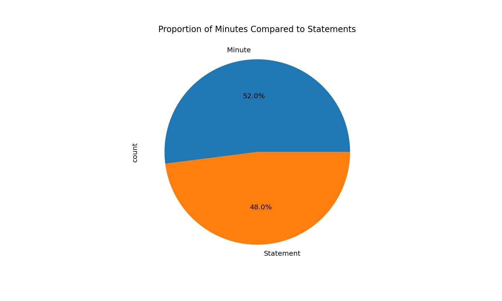
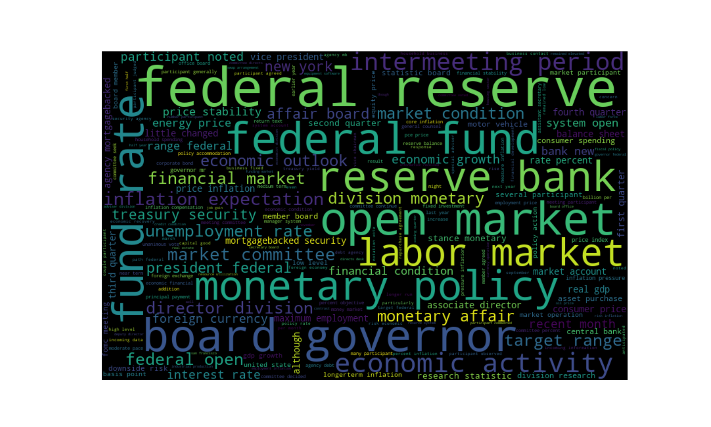
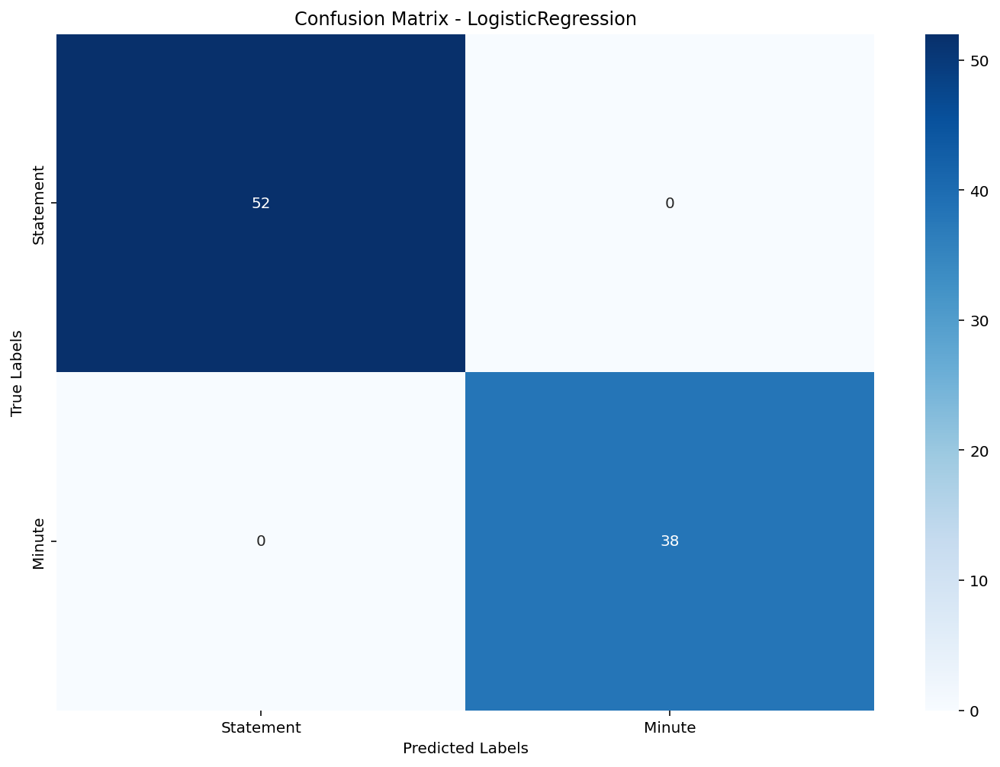

## FOMC Meeting NLP
This breif NLP project involves exploring and cleaning textual data. Using Part-of-Speech tagging and TF-IDF vectorization (via scikit-learn), features are extracted to build a model that classifies each entry as either a 'minute' or a 'statement' spanning from the year's: 2000-2025

## Requirements
```bash
pip install nltk wordcloud scikit-learn pandas contractions seaborn matplotlib
```


### The Target Variable Consist of the following proportion's of "Minute" and "Statement" from the FOMC Meetings



### After the text data is standardized, the text is then split for Part's of Speech Tagging and a WordCloud to visualize the most frequent words from the meetings


#### The tradional Machine Learning Models that are chosen for this model are:
* Logistic Regression
* Multinomial Naive Bayes
* Bernoulli Naive Bayes

The Scoring Metrics used are:
* Accuracy
* F1-Score


X_train and X_test are then fitted and transformed through scikit-learn's tfidvectorizer
### F1 Score


### Accuracy Score


### Finally, saving some details, a confusion matrix is graphed for each model



